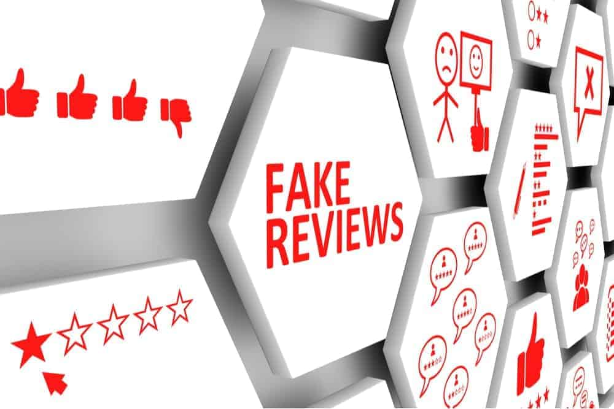

# Analysing Fake Review on E-Commerce

In e-commerce, user reviews can play a significant role in determining the revenue of an organisation. Online users rely on reviews before making decisions about any product and service. As such, the credibility of online reviews is crucial for businesses and can directly affect companies’ reputation and profitability. That is why some businesses are paying spammers to post fake reviews.

After constructing a text-based network, we investigated the characteristics shown by the graphs. Understanding the properties of these nodes and performing a differential analysis of the fake reviews compared to the original reviews helps us understand the distinctive properties while also providing us with an additional value add for utilising these internal characteristics to produce more accurate classifier models.
